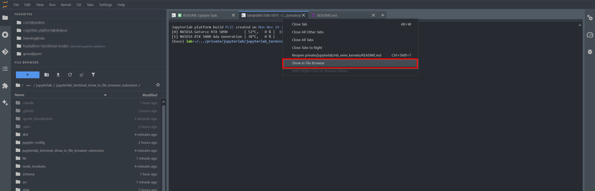

# jupyterlab_terminal_show_in_file_browser_extension

[](https://github.com/stellarshenson/jupyterlab_terminal_show_in_file_browser_extension/actions/workflows/build.yml)
[](https://www.npmjs.com/package/jupyterlab_terminal_show_in_file_browser_extension)
[](https://pypi.org/project/jupyterlab-terminal-show-in-file-browser-extension/)
[](https://pepy.tech/project/jupyterlab-terminal-show-in-file-browser-extension)
[](https://jupyterlab.readthedocs.io/en/stable/)
[](https://kolomolo.com)

> [!TIP]
> This extension is part of the [stellars_jupyterlab_extensions](https://github.com/stellarshenson/stellars_jupyterlab_extensions) metapackage. Install all Stellars extensions at once: `pip install stellars_jupyterlab_extensions`

Navigate the file browser to your terminal's current working directory with a single click. Right-click on any terminal tab and select "Show in File Browser" to instantly jump to the directory where your terminal session is working.

**Full disclosure:** This extension does exactly one thing. It's not revolutionary, it won't change your life, and it definitely won't impress anyone at parties. But every time you `cd` somewhere and wonder "where am I again?" - it'll be there for you. Quietly. Unremarkably. Like a good friend who never asks for credit.



## Features

- **Context menu on terminal tabs** - Right-click any terminal tab to reveal "Show in File Browser" option
- **Context menu in terminal area** - Also available when right-clicking inside the terminal
- **Server-side cwd detection** - Accurately determines terminal's working directory via process inspection
- **Cross-platform support** - Works on Linux (via /proc) and macOS (via lsof)
- **Graceful fallback** - Navigates to workspace root if terminal is outside the Jupyter workspace

## Installation

Requires JupyterLab 4.0.0 or higher.

```bash
pip install jupyterlab_terminal_show_in_file_browser_extension
```
